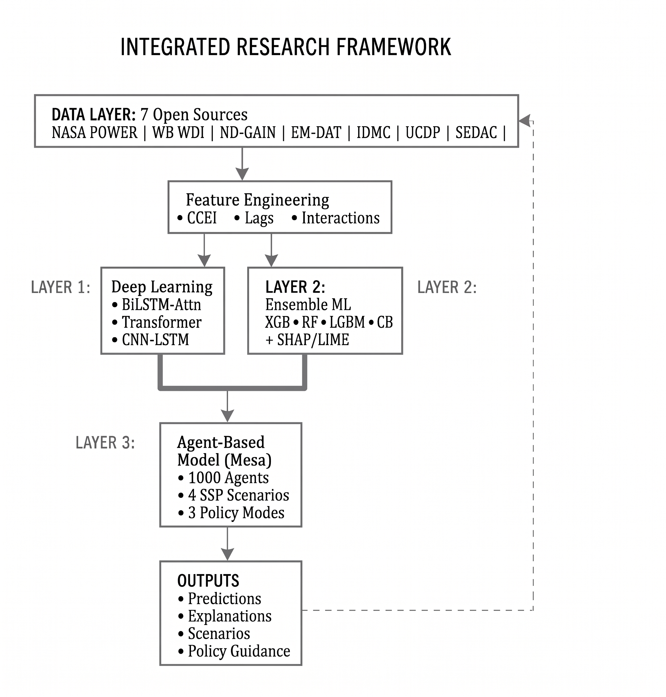

# Geo-Simulating Climate Extreme-Induced Human Migration Patterns using Agent-Based Modeling and Machine Learning

[](https://www.python.org/)
[](https://opensource.org/licenses/MIT)
[](https://github.com/projectmesa/mesa)
[](https://lightgbm.readthedocs.io/)
[](https://www.tensorflow.org/)
[](https://github.com/slundberg/shap)

**Authors:** Faizan Ali<sup>a,*</sup>, Tooba Asim Khan<sup>a</sup>  
**Affiliation:** <sup>a</sup> Institute of Environmental Studies, University of Karachi, Karachi, Pakistan  
**\* Corresponding Author:** Faizan Ali, Institute of Environmental Studies, University of Karachi. Email: [faizan.ali.71994@gmail.com](mailto:faizan.ali.71994@gmail.com)

---

## 📌 Project Overview

Climate-induced displacement is one of the most critical challenges facing disaster risk reduction (DRR) in South and Southeast Asia—the world's most densely populated and disaster-exposed corridor. Traditional empirical approaches in migration science typically rely either on aggregate macro-econometric regressions (which miss behavioral thresholds) or stylized simulation models (which lack dynamic meteorological forecasting inputs).

This repository contains the complete, reproducible computational research pipeline for an integrated **three-layer hybrid modeling framework**:
1. **Deep Learning Climate Forecasting (Layer 1):** Multi-hazard extreme event forecasting (heatwaves, droughts, riverine floods) from daily NASA POWER meteorological records using a Bidirectional LSTM network with Multi-Head Self-Attention (BiLSTM-Attention).
2. **Ensemble Machine Learning & Explainable AI (Layer 2):** Annual internal displacement magnitude prediction and severity classification using an ensemble of tree-based learners (LightGBM, XGBoost, CatBoost, Random Forest) with exact Shapley value attributions (TreeSHAP) across a 16-year panel (2008–2023).
3. **Geospatially Explicit Agent-Based Modeling (Layer 3):** Simulating household-level migration decision dynamics among 1,000 heterogeneous agents grounded in Hein de Haas's *aspirations-capabilities framework* under four IPCC Shared Socioeconomic Pathways (SSP1-2.6 to SSP5-8.5) and three governance policy regimes.

---

## 🏗️ Methodological Architecture

<p align="center">
  
</p>

---

## 📊 Key Findings & Benchmarks

* **Deep Learning Forecasting:** The BiLSTM-Attention network achieved a total multi-task loss of **0.127** on temporal holdout sequences, outperforming Transformer Encoder (0.312) and CNN-LSTM (0.298) baselines by effectively weighting 60–90 day antecedent weather indicators.
* **Ensemble Displacement Prediction:** LightGBM achieved the highest individual regression accuracy (**$R^2 = 0.927$**, $\text{RMSE} = 436,917$), while CatBoost achieved an accuracy of **0.763** in multi-class displacement severity categorization.
* **Compound Hazard Primacy (SHAP):** The Compound Climate Extremes Index ($\text{CCEI}$) ranked as the top predictor of displacement (mean $|\text{SHAP}| = 0.482$), followed by agricultural employment dependency ($0.371$) and consecutive dry days ($0.328$).
* **Empirical Validation of "Trapped Populations":** SHAP dependence analysis revealed a distinct **inverted-U relationship** between GDP per capita and displacement, demonstrating that impoverished households often lack the financial capabilities required to migrate.
* **Scenario Projections:** Under the extreme SSP5-8.5 climate trajectory with maladaptive governance, cumulative displacement surged by **340%** relative to the sustainable SSP1-2.6 baseline. Proactive DRR governance consistently reduced cumulative displacement by **25–35%** across all climate scenarios.

---

## 📁 Repository Organization

```text
climate-migration/
├── data/
│   └── processed/                     # Harmonized panel dataset & engineered features
│       ├── master_dataset.csv         # 192 country-year master panel (2008–2023)
│       ├── data_quality_report.csv    # Empirical missingness and range validation
│       └── feature_descriptions.csv   # Comprehensive 52-variable codebook
├── models/                            # Core model architectures
│   ├── climate_lstm_attention.py      # BiLSTM with Multi-Head Self-Attention architecture
│   ├── climate_transformer.py         # Transformer encoder baseline
│   ├── cnn_lstm_hybrid.py             # 1D-CNN + LSTM baseline
│   ├── migration_ensemble.py          # XGBoost, LightGBM, CatBoost, RF & Stacking regressor
│   └── explainability.py              # TreeSHAP, permutation importance & interaction calculations
├── abm/                               # Geospatially explicit Agent-Based Model
│   ├── agents.py                      # Household agent decision rules (Aspirations-Capabilities)
│   ├── model.py                       # Mesa spatial grid environment & SSP climate drivers
│   └── visualization.py               # Spatial migration maps & dynamic trajectory plots
├── analysis/                          # Empirical validation & simulation scripts
│   ├── 01_exploratory_analysis.py     # Summary statistics & correlation structures
│   ├── 02_statistical_tests.py        # Non-stationarity & panel cointegration tests
│   ├── 03_model_training.py           # DL & ML model training and hyperparameter tuning
│   └── 04_abm_experiments.py          # 50-run Monte Carlo experiments across 12 scenario regimes
├── notebooks/
│   └── colab_full_pipeline.py         # End-to-end Google Colab execution pipeline
├── paper/                             # Research figures & validation metrics
│   ├── figures/                       # 53 high-resolution publication figures & SHAP plots
│   └── metrics/                       # Evaluated model metrics & training histories
├── requirements.txt                   # Python package dependencies
├── CITATION.cff                       # Citation metadata format
├── LICENSE                            # MIT Open-Source License
└── README.md                          # Project documentation
```

---

## ⚙️ Quick Start & Reproduction Guide

### 1. Environment Setup

Clone the repository and install required Python packages:

```bash
git clone https://github.com/fali75/climate-migration.git
cd climate-migration
pip install -r requirements.txt
```

### 2. Exploratory Data Analysis & Panel Diagnostics

The pre-processed, harmonized master dataset is stored in `data/processed/master_dataset.csv` with all 52 engineered features, ETCCDI indices, and CCEI compound scores:

```bash
# Run summary statistics and bivariate correlation analyses
python analysis/01_exploratory_analysis.py

# Execute panel unit root and cointegration diagnostic tests
python analysis/02_statistical_tests.py
```

### 3. Model Training & Evaluation

Train the deep learning climate forecasting models and tree-based machine learning ensembles:

```bash
# Train BiLSTM-Attention, Transformer, CNN-LSTM, and Ensemble ML models
python analysis/03_model_training.py
```

### 4. Running the Agent-Based Simulation (ABM)

Execute the 1,000-agent Mesa simulation across 4 SSP climate scenarios and 3 governance policies:

```bash
python analysis/04_abm_experiments.py
```

---

## 📐 Mathematical Formulation of Compound Risk (CCEI)

The Compound Climate Extremes Index ($\text{CCEI}$) integrates multi-hazard indicators into a single continuous metric:

$$\text{CCEI} = \sum_{i=1}^{k} w_i \cdot \phi(X_i), \quad \text{where} \quad \sum_{i=1}^{k} w_i = 1$$

Where:
* $X_i$ represents constituent hazard indicators: Heat Wave Duration Index ($\text{HWDI}$), Consecutive Dry Days ($\text{CDD}$), Maximum 5-Day Precipitation ($\text{Rx5day}$), Very Wet Day Precipitation ($\text{R95p}$), Maximum Daily Temperature ($\text{TXx}$), and Diurnal Temperature Range ($\text{DTR}$).
* $\phi(\cdot)$ denotes sample-wide min-max normalization.
* Sub-weights ($w_i$) are calibrated according to empirical disaster impact distributions reported by IDMC and CRED: Heat Stress ($0.25$), Drought ($0.25$), Flood & Deluge ($0.25$), Temperature Extremes ($0.15$), and Warm Spells ($0.10$).

---

## 📖 Citation

If you utilize this framework, datasets, or simulation code in your research, please cite:

```bibtex
@misc{ali2026geosimulating,
  title={Geo-Simulating Climate Extreme-Induced Human Migration Patterns using Agent-Based Modeling and Machine Learning},
  author={Ali, Faizan and Khan, Tooba Asim},
  year={2026},
  howpublished={GitHub repository},
  url={https://github.com/fali75/climate-migration}
}
```

---

## 📜 License

This project is licensed under the **MIT License** — see the [LICENSE](LICENSE) file for details.
